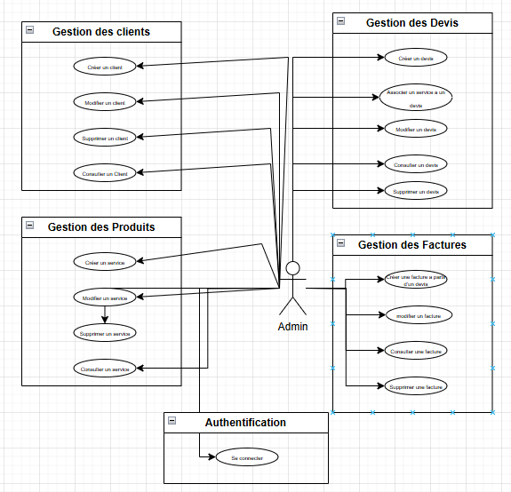
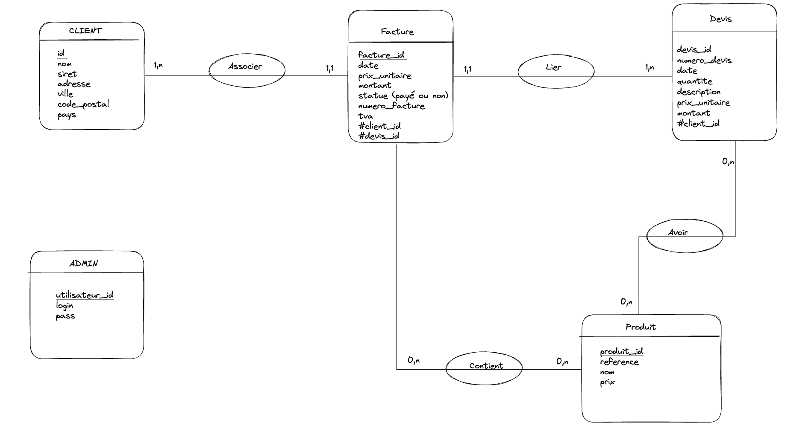

# 🧾 TikTakFacture

> 🕒 TikTakFacture, c’est l’allié des indépendants pressés.  
> Créez et envoyez vos factures avant même que le café ne refroidisse ☕

---

---

## 🚀 Présentation du service

TikTakFacture est une application **Micro-SaaS** dédiée aux indépendants, freelances et TPE qui souhaitent créer rapidement des **devis** et **factures professionnelles**, sans complexité.

### 🧠 Objectif

Faciliter la gestion administrative des petites entreprises avec une interface intuitive, rapide et accessible depuis n'importe où.

---

## 🎨 Charte graphique

**Palette de couleurs** :

- 🔷 **Bleu pétrole** : `#007C91`
- ⚪ **Gris clair** : `#F5F5F5`
- ⚪ **Blanc** : `#FFFFFF`
- ⚫ **Noir doux** : `#333333`

✒️ **Typographies** :
- Titres : `Poppins`, `Montserrat`
- Texte : `Roboto`, `Open Sans`

🖼️ **Style** :
- Illustrations minimalistes, icônes vectorielles, ambiance moderne et épurée

---

## 📌 Expression des besoins

### 🎯 Problème identifié

Les indépendants et petites structures perdent un temps précieux à gérer manuellement leurs devis et factures avec des outils inadaptés (Word, Excel).

### 👤 Public cible

- Indépendants, freelances
- Artisans, graphistes, développeurs, consultants

### 🧩 Fonctionnalité principale

- Création rapide de **devis** et **factures** professionnelles, avec téléchargement PDF ou envoi par email

### 🧱 Fonctionnalités secondaires

- Gestion des **clients**
- Suivi des **paiements**
- Tableau de bord simplifié

---

## ✏️ Wireframes & Zoning

🗂️ Aperçu rapide des interfaces proposées :
- **Dashboard** avec sidebar, résumé des factures et derniers documents
- **Formulaire de création de devis** avec champs : client, date, description, montant
- **Liste des devis** sous forme de tableau filtrable

📎 Voir `/wireframes` ou dans la présentation Canva pour les visuels associés.

---

## 🛠️ Stack technique

| Layer               | Technologie | Logo                                                                                                     |
|---------------------|-------------|----------------------------------------------------------------------------------------------------------|
| **Frontend**        | Angular     |  |
| **Backend**         | Symfony     |  |
| **Base de données** | MySQL       |        |

---

## 🔄 Diagramme de cas d'utilisation

Diagramme réalisé avec PlantUML :

- Gérer clients
- Gérer devis
- Gérer factures
- Se connecter

---

## 🗃️ MCD (Modèle Conceptuel de Données)

### Entités principales :

- **Client** : id, name, siret, adresse, code_postale, telephone, mail, isProfessionnel, createdAt, updatedAt
- **Devis** : id, numero_devis, date, client_id, montant_total, montant_ht, tva, montant_facture, montant_restant, active, service_id, createdAt, updatedAt
- **Facture** : id, numero_facture, date, devis_id, client_id, statut, montant, montant_ht, montant_paye, montant_restant, tva, createdAt, updatedAt
- **Service/Produits** : id, description, prix_unitaire, createdAt, updatedAt
- **User** : id, login, password

## 🎨 Maquettage de l'application

L’interface de **TikTakFacture** a été pensée pour être à la fois ergonomique et responsive, afin d’offrir une expérience utilisateur optimale sur desktop comme sur mobile.

### 🖥️ Écrans réalisés

- **Dashboard** : résumé des KPIs (chiffre d'affaires, nombre de devis/factures, etc.)
- **Service** : affichage de tous les services liés à la facturation
- **Gestion des clients** : tableau listant les clients avec options d'édition
- **Page de login** : formulaire d’authentification simple et épuré
- **Modal de modification client** : fenêtre popup permettant de modifier les informations d’un client

### 📱 Maquettes mobile

Des versions **mobile-first** ont été pensées pour :
- Le **dashboard**
- La **page de connexion**
- La **liste des clients**
- Le **formulaire de création de devis**

### 🔗 Prototypage interactif

Un **prototypage fonctionnel** a été mis en place entre chaque page pour simuler les parcours utilisateurs et tester les transitions, rendant la maquette totalement interactive.

🔗 Accéder à la maquette interactive sur Figma : [Voir la maquette TikTakFacture sur Figma](https://www.figma.com/proto/G5Vod0eCNS8gPwrTruKz3x/TikTakFacture?node-id=45-1136&t=Ux6MsX6n8W8L2Der-1)